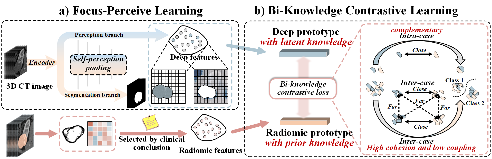

# BKC-Net: Bi-knowledge Contrastive Learning for Renal Tumor Diagnosis on 3D CT Images

**The codes will be published gradually and completely open after the paper is accepted!**

Renal tumor diagnosis on abdominal enhanced CT volumes is one of the most significant tasks in kidney disease diagnosis. It helps clinicians decide whether to perform the surgery (subtype classification), perform radical operations or minimally invasive treatment (grade classification).
However, inherent challenges greatly limit the performance of the model: 

**(1)** Tumor appearance difference caused by non-tumor factors. 

**(2)** Small inter-class difference and large intra-class variations. 

In this paper, we propose a novel diagnosis framework for renal tumors, Bi-knowledge Contrastive Network (BKC-Net), which has two innovations:

**(1)** ***Focus-percieve learning (FPL)*** segments the tumors while perceiving the surrounding healthy issues, thus adjusts the model's representation of tumor appearance, helping the BKC-Net characterize the inherent features of tumors.

**(2)** ***Bi-knowledge contrastive learning (BKC)*** forces the high cohesion and low coupling embedding feature space and discover subtle and essential difference among classes from the inter-case levels, and makes the prior radiomics and latent deep knowledge close and complementary to each other from the intra-case level.

Experiments demonstrate that our BKC-Net has the best performance of both tasks. Results reveal that our framework has great potential for renal tumor diagnosis in clinical use.

## Official implementation
* pytorch
* Mindspore

## Acknowledgements
This research was supported by the National Key Research and Development Program of China (2017YFC0109202), National Natural Science Foundation under grants (31800825, 31571001, 61828101), Excellence Project Funds of Southeast University, CAAI-Huawei MindSpore Open Fund and Scientific Research Foundation of Graduate School of Southeast University (YBPY2139). We thank the Big Data Computing Center of Southeast University for providing the facility support on the numerical calculations in this paper.

